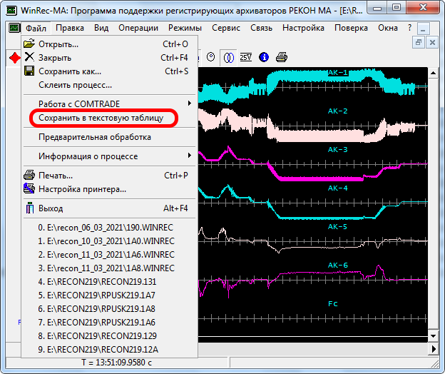

# Инструкция по работе с программой построения графиков
## 1. Установка программы.
Для работы программы необходимо установить интерпретатор [**python**](https://www.python.org/downloads/) версии 3.7 или выше со следующими библиотеками:
- numpy
- matplotlib
- pyside2

Для установки библиотек нужно в командной строке, запущенной с правами администратора выполнить команду:
`pip install numpy matplotlib pyside2`

## 2. Запуск программы.
Для запуска программы нужно выполнить файл recon.py.

## 3. Экспорт данных из программы WinReс MA.
Открыть в программе WinRec MA нужную запись регистратора.
В меню Файл выбрать пункт сохранить в текстовую таблицу.

